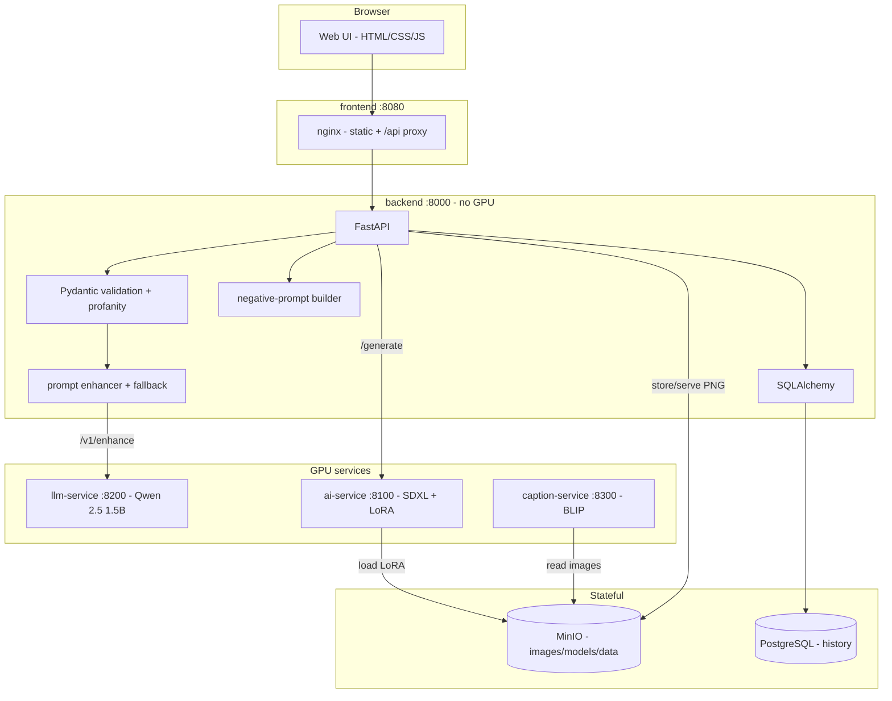
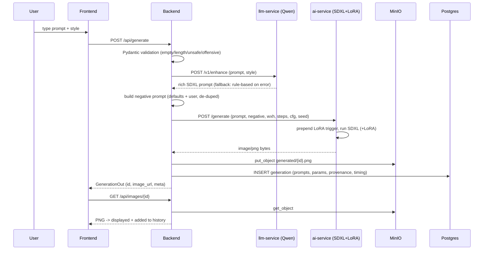
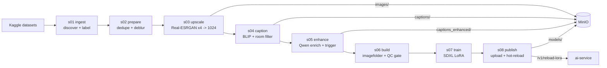

# Architecture

This document details the runtime topology, the request/training data flows, and
the contracts between services.

## 1. Service topology



## 2. Generation request flow

The core interaction flow, exactly as specified:



## 3. Workshop (LoRA training) DAG



Key data-quality decisions (see [workshop/README.md](workshop/README.md)):

- **Upscaling is mandatory** — both Kaggle datasets are web thumbnails
  (236px / 360px). Real-ESRGAN x4 recovers clean 1024px pixels so the SDXL VAE
  never trains on pixelation.
- **BLIP is a room-type filter** — the second dataset is style-labeled only and
  contains mixed rooms; unconditional BLIP captions are checked for living-room
  vs bedroom/kitchen/bathroom evidence, dropping non-living-rooms (galinakg is
  folder-labeled and kept as-is).
- **A caption QC gate** (s06) rebuilds any caption that describes the wrong room
  or runs away into repetition, guaranteeing clean training text.

## 4. Service contracts

| Service | Endpoint | Contract |
|---------|----------|----------|
| ai-service | `POST /generate` | JSON → `image/png` |
| ai-service | `POST /v1/reload-lora` | re-pull LoRA from MinIO, hot-swap |
| ai-service | `GET /health` | `{ready, lora_loaded, lora_source, ...}` |
| llm-service | `POST /v1/enhance` | short prompt → rich SDXL prompt |
| llm-service | `POST /v1/enhance-caption` | BLIP caption → training caption |
| caption-service | `POST /v1/caption/batch` | MinIO keys → captions |

Every GPU service loads its model once at startup and serializes GPU work behind
a lock, exposing `/health/live` (process up) and `/health/ready` (model loaded)
for orchestration.

## 5. Storage layout (MinIO)

```
interior-design-data/          generated-images/         models/
├── images/        (1024px)    └── generated/            └── living-room-style-v1/
├── captions/      (BLIP)          {uuid}.png                └── pytorch_lora_weights.safetensors
├── captions_enhanced/ (Qwen)
├── metadata/metadata.csv
└── lora_dataset/  (mirror)
```

## 6. Deployment modes

- **Docker Compose** (`docker-compose.yml`) — the intended production deployment;
  9 services incl. bucket init, healthchecks, and a `workshop` profile.
- **Native launcher** (`deploy/native/run_stack.sh`) — runs the *identical*
  service code as plain processes for hosts where Docker cannot run (unprivileged
  containers with no user-namespace / CAP_SYS_ADMIN). Same env, same ports.
